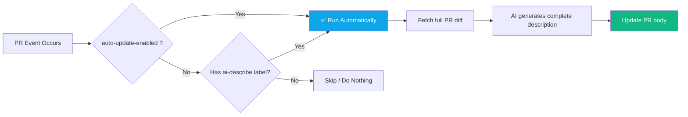

# AI Pull Request Describer
Automatically generate descriptions for pull requests using any OpenAI-compatible AI model (ChatGPT, DeepSeek, Groq, Ollama, etc.).

When you open or update a pull request labeled with **"ai-describe"**, this action will automatically generate a concise list of changes and update the pull request description (body) or post a comment.

## Demo / Review


## Features
- **High-Performance**: Uses pre-built binaries for near-instant startup (no Docker build overhead).
- **Multi-Model Support**: Works with OpenAI, DeepSeek, Groq, or any OpenAI-compatible API.

## Requirements
* API key from your chosen AI provider (OpenAI, DeepSeek, etc.).

## Usage

### Option 1: Manual Label Mode (Default)
Add the label `ai-describe` to any pull request to trigger generation.

### Option 2: Auto-Update Mode (Recommended)
Enable `auto-update-enabled: true` to automatically generate and update the PR description **every time new commits are pushed**, no labels required. The description will always stay up to date with the latest changes.

Add the following workflow file to your repository in `.github/workflows/ai-pr-describer.yml`:

```yaml
name: AI Pull Request Describer

on:
  pull_request_target:
    types: [opened, synchronize, labeled, reopened]

jobs:
  describe:
    runs-on: ubuntu-latest
    permissions:
      contents: write
      pull-requests: write
    steps:
      - name: Checkout repository
        uses: actions/checkout@v4
        with:
          fetch-depth: 0

      - name: AI Pull Request Describer
        uses: fajarhide/ai-pr-describer@v1.1.2 # Use the latest released version for best performance
        with:
          github-token: ${{ secrets.GITHUB_TOKEN }}
          github-api-base-url: 'https://api.github.com'
          openai-api-key: ${{ secrets.OPENAI_API_KEY }}
          openai-model: '${{ secrets.OPENAI_MODEL }}'
          openai-base-url: '${{ secrets.OPENAI_BASE_URL }}'
          max-tokens: 2000
          max-context-tokens: 256000
          auto-update-enabled: false
```

## AI Provider Examples

### OpenAI (Default)
```yaml
openai-model: 'gpt-4o'
```

### DeepSeek
```yaml
openai-api-key: ${{ secrets.OPENAI_API_KEY }}
openai-model: 'deepseek-chat'
openai-base-url: 'https://api.deepseek.com'
```

### Groq
```yaml
openai-api-key: ${{ secrets.OPENAI_API_KEY }}
openai-model: 'llama3-8b-8192'
openai-base-url: 'https://api.groq.com/openai/v1'
```

### GLM (Zhipu AI)
```yaml
openai-api-key: ${{ secrets.OPENAI_API_KEY }}
openai-model: 'glm-4'
openai-base-url: 'https://open.bigmodel.cn/api/paas/v4'
max-context-tokens: 128000 # adjust based on model capability
```

### Ollama (Local/Self-hosted)
```yaml
openai-api-key: 'ollama' # usually not required but cannot be empty
openai-model: 'llama3'
openai-base-url: 'http://your-ollama-host:11434/v1'
```

## How It Works



Supported events:
- `opened` - when PR is first created
- `synchronize` - **every time new commits are pushed**
- `labeled` - when `ai-describe` label is added
- `reopened` - when PR is reopened

## Configuration

| Name                   | Required | Description                                                                 | Default             |
|------------------------|----------|-----------------------------------------------------------------------------|---------------------|
| `github-token`         | ✅ Yes    | GitHub API token, use `${{ secrets.GITHUB_TOKEN }}`                         |                     |
| `openai-api-key`       | ✅ Yes    | API Key for your AI provider (OpenAI, DeepSeek, Groq, etc.)                 |                     |
| `openai-model`         | ❌ No     | AI model to use                                                             | `gpt-3.5-turbo`     |
| `openai-base-url`      | ❌ No     | Custom base URL for OpenAI-compatible APIs                                  |                     |
| `max-tokens`           | ❌ No     | Maximum output tokens for generated description                             | `2000`              |
| `max-context-tokens`   | ❌ No     | Maximum total context tokens (input diff + prompt + output)                 | `32000`             |
| `auto-update-enabled`  | ❌ No     | Auto update PR description on every new commit. No labels required.         | `false`             |

## Performance

This action is now a **Composite Action** using pre-built binaries. It typically runs in **under 15 seconds**, compared to ~2.5 minutes for Docker-based actions.

> [!IMPORTANT]
> To use this action in your own fork, you must first create a Release (e.g. `v1.0.0`) to trigger the build and upload of binaries.

## Troubleshooting 💡

### "Missing required environment variables"
This error occurs when the required secrets are not passed to the action. Ensure you have:
1. Created a secret named `OPENAI_API_KEY` in your repository settings (**Settings > Secrets and variables > Actions**).
2. Passed the secrets in your workflow file as shown in the [Usage](#usage) section.

> [!NOTE]
> You **do not** need to create `GITHUB_TOKEN` yourself. It is a built-in secret provided automatically by GitHub Actions. You only need to create custom secrets like `OPENAI_API_KEY` etc.


### Pull Requests from Forks
By default, GitHub does not pass secrets to workflows triggered by pull requests from forked repositories for security reasons. If a contributor from a fork opens a PR, the action will fail with a "Missing required environment variables" error because it cannot access your `OPENAI_API_KEY`.

To fix this, you can:
- Manually run the action on the PR after it's been opened by a maintainer.
- (Use with caution) Use the `pull_request_target` event instead of `pull_request`, but be aware of the security implications.

### Changelog

Please see [CHANGELOG](CHANGELOG.md) for more information what has changed recently.
## Contributing

Please see [CONTRIBUTING](CONTRIBUTING.md) for details.
## Credits

-   [Fajar Hidayat](https://github.com/fajarhide)
-   [All Contributors](../../contributors)
## License

The MIT License (MIT). Please see [License File](LICENSE) for more information.
